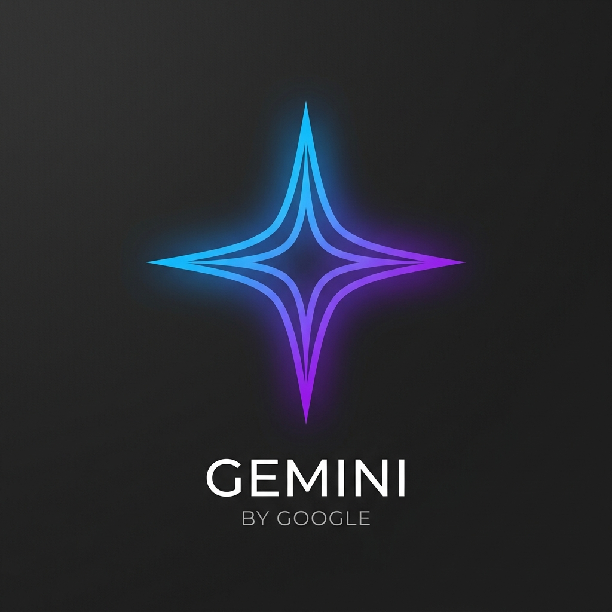
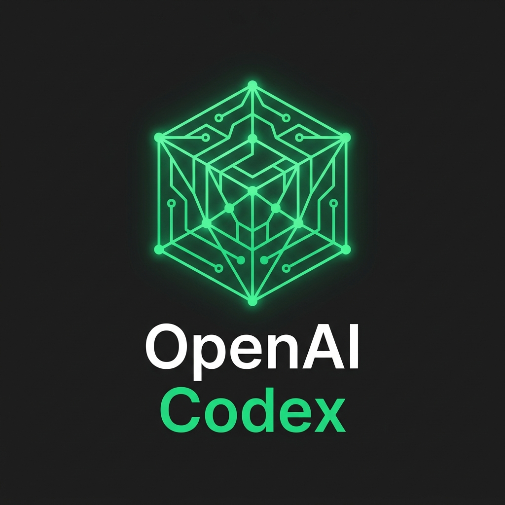
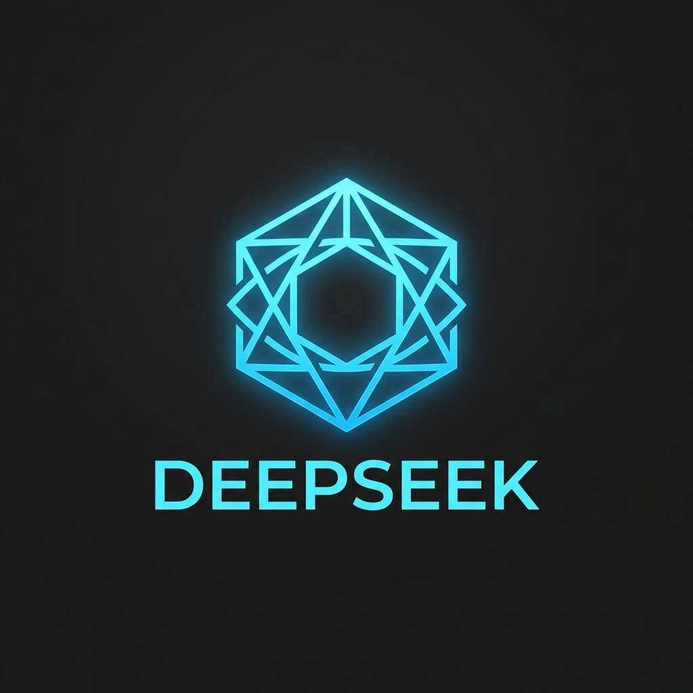

# open-grok-build


Give Grok Build access to third-party models natively, without background services.

These connectors spin up light, zero-dependency inline HTTP proxies on-the-fly only when Grok is running.

## Connectors

All connectors are distributed in a single, unified npm package `open-grok-build`.

| Command | Logo | Default Model | Config Snippet | Description |
| :--- | :--- | :--- | :--- | :--- |
| **`grok-agy`** |  | `gemini-3.5-flash` | [toml](providers/agy/templates/grok-config-snippet.toml) | Gemini models via Antigravity CLI OAuth |
| **`grok-codex`** |  | `gpt-5.5` | [toml](providers/codex/templates/grok-config-snippet.toml) | Codex models via CLIProxyAPI OAuth |
| **`grok-deepseek`** |  | `deepseek-v4-flash` | [manifest](providers/providers.json) | DeepSeek API direct compatible-mode integration |
| **`grok-qwen`** |  | `qwen2.5-coder-32b-instruct` | [manifest](providers/providers.json) | Alibaba DashScope Qwen2.5-Coder models |

> The full connector list is the single source of truth in [`providers/providers.json`](providers/providers.json). See [CONTRIBUTING.md](CONTRIBUTING.md) to add one.

---

## Interactive Configuration Console & TUI

`open-grok-build` provides a zero-dependency interactive control panel to manage all your model connectors.

### Usage

```bash
# Launch interactive TUI config console
npx open-grok-build
```

### Headless/Non-Interactive Commands

Install individual connectors directly from the command line:

```bash
npx open-grok-build agy        # Installs Gemini/Antigravity connector
npx open-grok-build codex      # Installs Codex connector
npx open-grok-build deepseek   # Installs DeepSeek connector
npx open-grok-build qwen       # Installs Qwen Coder connector
npx open-grok-build all        # Installs all connectors at once
```

---

## Features
* **Status Monitor**: Checks the installation status of all connectors and reports their active default models.
* **Active Model Switcher**: Swap between connectors (`agy`, `codex`, `deepseek`, `qwen`) as the active default model in your `~/.grok/config.toml` with a single keypress.
* **Option Adjuster**: Switch default models inside each connector (e.g. `gpt-5.5` vs `gpt-5.4` on Codex, or `gemini-3.5-flash` vs `gemini-3-pro` on AGY).
* **Quick Installer**: Setup any or all connectors with execution logs rendered inline.

---

## Getting Started

### Local Setup (Clone)
Everything lives in this one repository — no submodules to initialize:

```bash
git clone https://github.com/jamubc/open-grok-build.git
cd open-grok-build
```

### Global Install
Alternatively, install everything globally via npm:

```bash
npm install -g open-grok-build
```

This registers the following commands globally:
- `open-grok-build` (the TUI configurations manager)
- `grok-agy` (runs grok with Antigravity proxy)
- `grok-codex` (runs grok with Codex proxy)
- `grok-deepseek` (runs grok with DeepSeek)
- `grok-qwen` (runs grok with Qwen Coder)

---

## Issues & Contributions

Have a bug or feature request?
* Please open an issue on the **[GitHub Issue Tracker](https://github.com/jamubc/open-grok-build/issues)**.
* Check the **[Releases & Downloads](https://github.com/jamubc/open-grok-build/releases)** for stable tags and archives.
